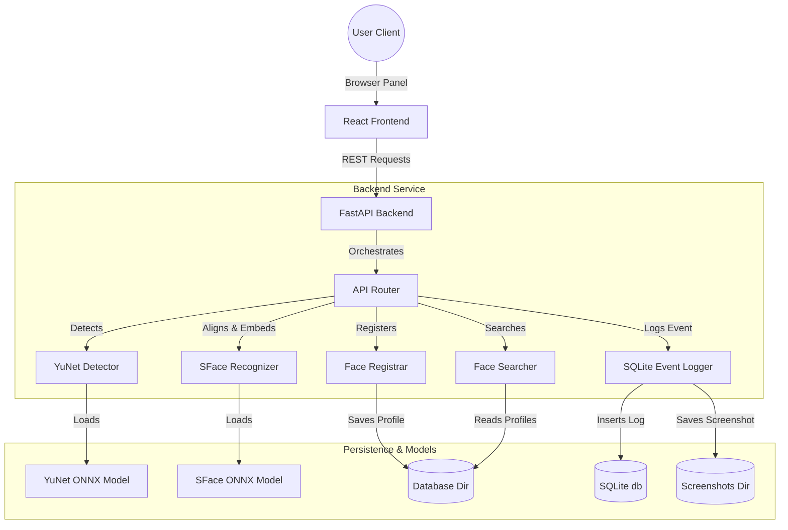

# System Architecture

The VisionMind-AI system uses a decoupled client-server architecture.

## Main Architectural Components

1. **Vision Core (`vision/`)**:
   - `vision/detection/`: Employs OpenCV FaceDetectorYN for high-precision face landmark localization.
   - `vision/embeddings/` & `vision/recognition/`: Employs SFace for face alignment cropping, feature extraction (128-d vector), and cosine distance validation.
   - `vision/registration/`: Saves face models.
   - `vision/events/`: Interacts with SQLite to ensure deduplicated logging.

2. **Web Backend (`backend/`)**:
   - Built on FastAPI for speed and validation support.
   - Decodes images directly into memory arrays to be consumed by OpenCV, reducing filesystem writes.

3. **User Client (`frontend/`)**:
   - Single-Page dashboard built on React & TailwindCSS.
   - Communicates with APIs using asynchronous REST calls.
   - Feeds the local user camera to a Canvas context, grabbing snapshots to perform matching against the server.
